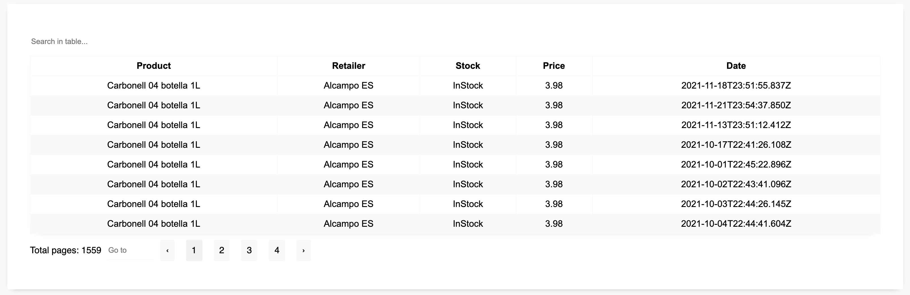
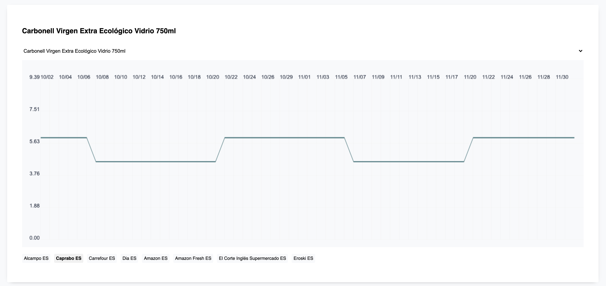

# Challenge

## Setup

```
npm install
npm start
```

## Notes

Notes:
Table and Chart are reusable components, implemented without libraries for the purpose of practice.

### Table


### Chart


## New Updates
- Improve the logic of drawing axes and the projection of data.
- Handle chart with empty data add auto zoom.
- Minimize the number of renders.
- Use useDebounce for search.

## Pending
- Print the max/min price in chart.
- Move sass files to styles directory.
- Refactor.
